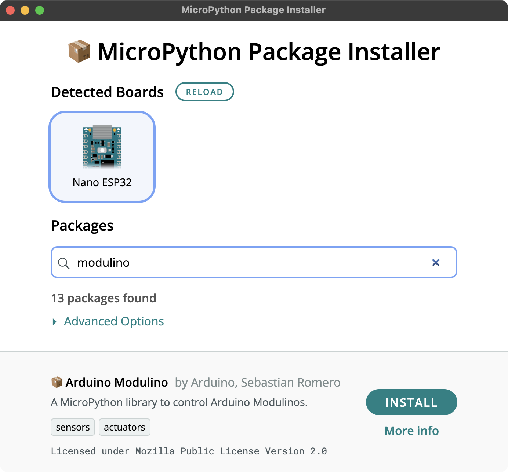

# 🐍 MicroPython Package Index

A list of useful MicroPython packages that can be used with the compatible Arduino products.
Packages that are added to this index automatically show up in the Arduino Package Installer tool which can be downloaded [here](https://github.com/arduino/lab-micropython-package-installer/releases/latest). 

## 🤲 Contributing

Please read the [contribution guidelines](./CONTRIBUTING.md) to learn how to add your MicroPython packages to the MicroPython Package Index.

## 📦 Packages
### [Arduino Alvik micropython library](https://github.com/arduino/arduino-alvik-mpy)

This package enables control of the Arduino Alvik educational robot from MicroPython, and includes helper functions for programming the robot.  

Details

<ul>
<li>🌐 <strong>URL:</strong> https://github.com/arduino/arduino-alvik-mpy</li>
<li>👤 <strong>Author:</strong> Arduino, Lucio Rossi, Giovanni di Dio Bruno</li>
<li>📜 <strong>License:</strong> Mozilla Public License Version 2.0</li>
<li>🏷️ <strong>Tags:</strong> arduino, programming, helpers, robotics</li>
</ul>

### [Arduino Modulino](https://github.com/arduino/arduino-modulino-mpy)

A MicroPython library to control Arduino Modulinos.  

Details

<ul>
<li>🌐 <strong>URL:</strong> https://github.com/arduino/arduino-modulino-mpy</li>
<li>👤 <strong>Author:</strong> Arduino, Sebastian Romero</li>
<li>📜 <strong>License:</strong> Mozilla Public License Version 2.0</li>
<li>🏷️ <strong>Tags:</strong> sensors, actuators</li>
</ul>

### [Arduino Nicla Sense Env](https://github.com/arduino/arduino-nicla-sense-env-mpy)

A MicroPython library to control the Arduino Nicla Sense Env.  

Details

<ul>
<li>🌐 <strong>URL:</strong> https://github.com/arduino/arduino-nicla-sense-env-mpy</li>
<li>👤 <strong>Author:</strong> Arduino, Sebastian Romero</li>
<li>📜 <strong>License:</strong> Mozilla Public License Version 2.0</li>
<li>🏷️ <strong>Tags:</strong> sensors, environment</li>
</ul>

### [Arduino Runtime for MicroPython](https://github.com/arduino/arduino-runtime-mpy)

Easily build sketches with setup/loop and use familiar Arduino APIs in MicroPython.  

Details

<ul>
<li>🌐 <strong>URL:</strong> https://github.com/arduino/arduino-runtime-mpy</li>
<li>👤 <strong>Author:</strong> Arduino, Ubi de Feo, Sebastian Romero</li>
<li>📜 <strong>License:</strong> Mozilla Public License Version 2.0</li>
<li>🏷️ <strong>Tags:</strong> arduino, programming, helpers</li>
</ul>

### [Arduino Tools for MicroPython](https://github.com/arduino/arduino-tools-mpy)

This package adds the MicroPython apps framework, file system helpers, and WiFi network management.  

Details

<ul>
<li>🌐 <strong>URL:</strong> https://github.com/arduino/arduino-tools-mpy</li>
<li>👤 <strong>Author:</strong> Arduino, Ubi de Feo</li>
<li>📜 <strong>License:</strong> Mozilla Public License Version 2.0</li>
<li>🏷️ <strong>Tags:</strong> arduino, programming, helpers, application, network</li>
</ul>

### [BME280](https://github.com/robert-hh/BME280)

MicroPython driver for the BME280 sensor, target platform Pycom devices.  

Details

<ul>
<li>🌐 <strong>URL:</strong> https://github.com/robert-hh/BME280</li>
<li>👤 <strong>Author:</strong> Robert Hammelrath</li>
<li>🏷️ <strong>Tags:</strong> pressure, temperature, humidity</li>
</ul>

### [BME680-Micropython](https://github.com/robert-hh/BME680-Micropython)

Micropython Driver for a BME680 breakout. The driver uses the I2C interface.  

Details

<ul>
<li>🌐 <strong>URL:</strong> https://github.com/robert-hh/BME680-Micropython</li>
<li>👤 <strong>Author:</strong> Robert Hammelrath</li>
<li>🏷️ <strong>Tags:</strong> sensor</li>
<li>✅ <strong>Verification:</strong>
<ul>
<li>Verified with <code>arduino:mbed_nano:nanorp2040connect</code> on MicroPython vundefined</li>
</ul></li>
</ul>

### [HT16K33-Python](https://github.com/smittytone/HT16K33-Python)

Python drivers for the Holtek HT16K33 controller chip and various display devices based upon it, such as the Adafruit 0.8-inch 8x16 LED Matrix FeatherWing and the Raspberry Pi Pico. The drivers support both CircuitPython and MicroPython applications. They communicate using I²C.  

Details

<ul>
<li>🌐 <strong>URL:</strong> https://github.com/smittytone/HT16K33-Python</li>
<li>👤 <strong>Author:</strong> smittytone</li>
<li>📜 <strong>License:</strong> Licensed under the MIT License.</li>
<li>🏷️ <strong>Tags:</strong> LED, matrix, segment, adafruit</li>
<li>✅ <strong>Verification:</strong>
<ul>
<li>Verified v3.4.2 with <code>arduino:esp32:nano_nora</code> on MicroPython vundefined</li>
<li>Verified v3.4.2 with <code>esp32:esp32:esp32s3</code> on MicroPython vundefined</li>
</ul></li>
</ul>

### [MAX30102-MicroPython-driver](https://github.com/n-elia/MAX30102-MicroPython-driver)

A port of the SparkFun driver for Maxim MAX30102 sensor to MicroPython.  

Details

<ul>
<li>🌐 <strong>URL:</strong> https://github.com/n-elia/MAX30102-MicroPython-driver</li>
<li>👤 <strong>Author:</strong> n-elia</li>
<li>📜 <strong>License:</strong> MIT License</li>
<li>🏷️ <strong>Tags:</strong> sensors</li>
</ul>

### [MicroPython PCF85263A Driver](https://github.com/arduino/micropython-pcf85263a)

Use the PCF85263A real time clock to read back the current time. Supports alarms and stopwatch mode.  

Details

<ul>
<li>🌐 <strong>URL:</strong> https://github.com/arduino/micropython-pcf85263a</li>
<li>👤 <strong>Author:</strong> Arduino, Sebastian Romero</li>
<li>📜 <strong>License:</strong> MPL-2.0</li>
<li>🏷️ <strong>Tags:</strong> RTC</li>
</ul>

### [MicroPython QMI8658C Driver](https://github.com/sebromero/micropython-qmi8658c)

MicroPython library to access the QMI8658C 6-DoF accelerometer and gyroscope  

Details

<ul>
<li>🌐 <strong>URL:</strong> https://github.com/sebromero/micropython-qmi8658c</li>
<li>👤 <strong>Author:</strong> Sebastian Romero</li>
<li>📜 <strong>License:</strong> MPL-2.0</li>
<li>🏷️ <strong>Tags:</strong> IMU</li>
</ul>

### [MicroPython-Button](https://github.com/ubidefeo/MicroPython-Button)

An easy-to-use MicroPython library to handle buttons and other devices with digital (LOW/HIGH) output.  

Details

<ul>
<li>🌐 <strong>URL:</strong> https://github.com/ubidefeo/MicroPython-Button</li>
<li>👤 <strong>Author:</strong> Ubi de Feo</li>
<li>🏷️ <strong>Tags:</strong> input, button</li>
<li>✅ <strong>Verification:</strong>
<ul>
<li>Verified with <code>arduino:mbed_nano:nanorp2040connect</code> on MicroPython vundefined</li>
</ul></li>
</ul>

### [Motor Carrier Library for MicroPython (ESP32)](https://github.com/kevinmcaleer/arduino_nano_motor_carrier_mp)

Control the Arduino Motor Carrier shield, including DC motors, servo motors, encoders, PID control, and battery monitoring.  

Details

<ul>
<li>🌐 <strong>URL:</strong> https://github.com/kevinmcaleer/arduino_nano_motor_carrier_mp</li>
<li>👤 <strong>Author:</strong> Kevin McAleer</li>
<li>📜 <strong>License:</strong> BSD-3-Clause license</li>
<li>🏷️ <strong>Tags:</strong> motor</li>
</ul>

### [SH1106](https://github.com/robert-hh/SH1106)

MicroPython driver for the SH1106 OLED controller  

Details

<ul>
<li>🌐 <strong>URL:</strong> https://github.com/robert-hh/SH1106</li>
<li>👤 <strong>Author:</strong> Robert Hammelrath</li>
<li>📜 <strong>License:</strong> MIT License</li>
<li>🏷️ <strong>Tags:</strong> display, OLED</li>
</ul>

### [ads1x15](https://github.com/robert-hh/ads1x15)

MicroPython driver for the ADS1x15 ADCs  

Details

<ul>
<li>🌐 <strong>URL:</strong> https://github.com/robert-hh/ads1x15</li>
<li>👤 <strong>Author:</strong> Robert Hammelrath</li>
<li>🏷️ <strong>Tags:</strong> ADC</li>
</ul>

### [arduino-iot-cloud-py](https://github.com/arduino/arduino-iot-cloud-py)

A Python client for the Arduino IoT cloud, which runs on both CPython and MicroPython.  

Details

<ul>
<li>🌐 <strong>URL:</strong> https://github.com/arduino/arduino-iot-cloud-py</li>
<li>👤 <strong>Author:</strong> Arduino</li>
<li>📜 <strong>License:</strong> Mozilla Public License Version 2.0</li>
<li>🏷️ <strong>Tags:</strong> cloud, iot</li>
<li>✅ <strong>Verification:</strong>
<ul>
<li>Verified v0.0.7 with <code>arduino:mbed_portenta:envie_m7</code> on MicroPython vundefined</li>
</ul></li>
</ul>

### [micropython-DS3231-AT24C32](https://github.com/pangopi/micropython-DS3231-AT24C32)

MicroPython driver for DS3231 RTC and AT24C32 EEPROM module.  

Details

<ul>
<li>🌐 <strong>URL:</strong> https://github.com/pangopi/micropython-DS3231-AT24C32</li>
<li>👤 <strong>Author:</strong> pangopi</li>
<li>📜 <strong>License:</strong> MIT License</li>
<li>🏷️ <strong>Tags:</strong> time, RTC</li>
</ul>

### [micropython-dfplayer](https://github.com/ubidefeo/micropython-dfplayer)

Micropython implementation of DFPlayer control over UART  

Details

<ul>
<li>🌐 <strong>URL:</strong> https://github.com/ubidefeo/micropython-dfplayer</li>
<li>👤 <strong>Author:</strong> Ubi de Feo</li>
<li>📜 <strong>License:</strong> MIT License</li>
<li>🏷️ <strong>Tags:</strong> audio, mp3</li>
<li>✅ <strong>Verification:</strong>
<ul>
<li>Verified with <code>arduino:mbed_nano:nanorp2040connect</code> on MicroPython vundefined</li>
</ul></li>
</ul>

### [micropython-i2c-lcd](https://github.com/ubidefeo/micropython-i2c-lcd)

This library is designed to support a MicroPython interface for i2c LCD character screens. It is designed around the Pycom implementation of MicroPython  

Details

<ul>
<li>🌐 <strong>URL:</strong> https://github.com/ubidefeo/micropython-i2c-lcd</li>
<li>👤 <strong>Author:</strong> Ubi de Feo</li>
<li>📜 <strong>License:</strong> MIT License</li>
<li>🏷️ <strong>Tags:</strong> display, LCD, RGB</li>
</ul>

### [micropython-i2c-lcd-monochrome](https://github.com/brainelectronics/micropython-i2c-lcd)

Micropython package to control HD44780 LCD displays 1602 and 2004 via I2C  

Details

<ul>
<li>🌐 <strong>URL:</strong> https://github.com/brainelectronics/micropython-i2c-lcd</li>
<li>👤 <strong>Author:</strong> brainelectronics</li>
<li>📜 <strong>License:</strong> MIT</li>
</ul>

### [micropython-ir-rx](https://github.com/peterhinch/micropython_ir/ir_rx)

Nonblocking device drivers to receive from IR (infra red) remotes.  

Details

<ul>
<li>🌐 <strong>URL:</strong> https://github.com/peterhinch/micropython_ir/ir_rx</li>
<li>👤 <strong>Author:</strong> Peter Hinch</li>
<li>📜 <strong>License:</strong> MIT</li>
<li>🏷️ <strong>Tags:</strong> IR</li>
</ul>

### [micropython-ir-tx](https://github.com/peterhinch/micropython_ir/ir_tx)

Nonblocking device drivers for IR (infra red) blaster apps.  

Details

<ul>
<li>🌐 <strong>URL:</strong> https://github.com/peterhinch/micropython_ir/ir_tx</li>
<li>👤 <strong>Author:</strong> Peter Hinch</li>
<li>📜 <strong>License:</strong> MIT</li>
<li>🏷️ <strong>Tags:</strong> IR</li>
</ul>

### [micropython-max7219](https://github.com/mcauser/micropython-max7219)

A MicroPython library for the MAX7219 8x8 LED matrix driver, SPI interface, supports cascading and uses framebuf.  

Details

<ul>
<li>🌐 <strong>URL:</strong> https://github.com/mcauser/micropython-max7219</li>
<li>👤 <strong>Author:</strong> Mike Causer</li>
<li>📜 <strong>License:</strong> Licensed under the MIT License.</li>
<li>🏷️ <strong>Tags:</strong> LED, matrix</li>
</ul>

### [micropython-mcp23017](https://github.com/mcauser/micropython-mcp23017)

A MicroPython library for the MCP23017 16-bit I/O Expander with I2C Interface.  

Details

<ul>
<li>🌐 <strong>URL:</strong> https://github.com/mcauser/micropython-mcp23017</li>
<li>👤 <strong>Author:</strong> Mike Causer</li>
<li>📜 <strong>License:</strong> MIT License</li>
<li>🏷️ <strong>Tags:</strong> I/O, expander</li>
</ul>

### [micropython-mlx90614](https://github.com/mcauser/micropython-mlx90614)

A MicroPython library for interfacing with a Melexis MLX90614 IR temperature sensor.  

Details

<ul>
<li>🌐 <strong>URL:</strong> https://github.com/mcauser/micropython-mlx90614</li>
<li>👤 <strong>Author:</strong> Mike Causer</li>
<li>📜 <strong>License:</strong> MIT License</li>
<li>🏷️ <strong>Tags:</strong> sensor, temperature</li>
</ul>

### [micropython-modbus](https://github.com/brainelectronics/micropython-modbus)

MicroPython ModBus TCP and RTU library supporting client and host mode  

Details

<ul>
<li>🌐 <strong>URL:</strong> https://github.com/brainelectronics/micropython-modbus</li>
<li>👤 <strong>Author:</strong> brainelectronics</li>
<li>📜 <strong>License:</strong> GNU General Public License</li>
<li>🏷️ <strong>Tags:</strong> modbus</li>
</ul>

### [micropython-mpr121](https://github.com/mcauser/micropython-mpr121)

MicroPython driver for MPR121 capacitive touch keypads and breakout boards.  

Details

<ul>
<li>🌐 <strong>URL:</strong> https://github.com/mcauser/micropython-mpr121</li>
<li>👤 <strong>Author:</strong> Mike Causer</li>
<li>📜 <strong>License:</strong> MIT License</li>
<li>🏷️ <strong>Tags:</strong> sensor, touch</li>
</ul>

### [micropython-my9221](https://github.com/mcauser/micropython-my9221)

A MicroPython library for 10 segment LED bar graph modules using the MY9221 LED driver.  

Details

<ul>
<li>🌐 <strong>URL:</strong> https://github.com/mcauser/micropython-my9221</li>
<li>👤 <strong>Author:</strong> Mike Causer</li>
<li>🏷️ <strong>Tags:</strong> LED</li>
<li>✅ <strong>Verification:</strong>
<ul>
<li>Verified with <code>arduino:mbed_nano:nanorp2040connect</code> on MicroPython vundefined</li>
</ul></li>
</ul>

### [micropython-rotary](https://github.com/miketeachman/micropython-rotary)

MicroPython driver to read a rotary encoder. Works with Pyboard, Raspberry Pi Pico, ESP8266, and ESP32 development boards. This is a robust implementation providing effective debouncing of encoder contacts. It uses two GPIO pins configured to trigger interrupts, ...  

Details

<ul>
<li>🌐 <strong>URL:</strong> https://github.com/miketeachman/micropython-rotary</li>
<li>👤 <strong>Author:</strong> miketeachman</li>
<li>📜 <strong>License:</strong> MIT License</li>
<li>🏷️ <strong>Tags:</strong> encoder</li>
<li>✅ <strong>Verification:</strong>
<ul>
<li>Verified with <code>arduino:mbed_nano:nanorp2040connect</code> on MicroPython vundefined</li>
</ul></li>
</ul>

### [micropython-ssd1309](https://github.com/rdagger/micropython-ssd1309)

MicroPython SPI and I2C Display Driver for SSD1309 monochrome OLED  

Details

<ul>
<li>🌐 <strong>URL:</strong> https://github.com/rdagger/micropython-ssd1309</li>
<li>👤 <strong>Author:</strong> rdagger</li>
<li>📜 <strong>License:</strong> Licensed under the MIT License.</li>
<li>🏷️ <strong>Tags:</strong> oled</li>
</ul>

### [micropython-thermal-printer](https://github.com/ayoy/micropython-thermal-printer)

This is the MicroPython port of Python Thermal Printer by Adafruit.  

Details

<ul>
<li>🌐 <strong>URL:</strong> https://github.com/ayoy/micropython-thermal-printer</li>
<li>👤 <strong>Author:</strong> ayoy</li>
<li>🏷️ <strong>Tags:</strong> printer</li>
</ul>

### [micropython-tm1637](https://github.com/mcauser/micropython-tm1637)

A MicroPython library for quad 7-segment LED display modules using the TM1637 LED driver. For example, the Grove - 4 Digit Display module http://wiki.seeed.cc/Grove-4-Digit_Display/  

Details

<ul>
<li>🌐 <strong>URL:</strong> https://github.com/mcauser/micropython-tm1637</li>
<li>👤 <strong>Author:</strong> Mike Causer</li>
<li>🏷️ <strong>Tags:</strong> display</li>
<li>✅ <strong>Verification:</strong>
<ul>
<li>Verified v1.3.0 with <code>arduino:mbed_nano:nanorp2040connect</code> on MicroPython vundefined</li>
</ul></li>
</ul>

### [micropython_ahtx0](https://github.com/targetblank/micropython_ahtx0)

MicroPython driver for the AHT10 and AHT20 temperature and humidity sensors.  

Details

<ul>
<li>🌐 <strong>URL:</strong> https://github.com/targetblank/micropython_ahtx0</li>
<li>👤 <strong>Author:</strong> targetblank</li>
<li>📜 <strong>License:</strong> MIT License</li>
<li>🏷️ <strong>Tags:</strong> sensors, temperature, humidity</li>
</ul>

### [micropython_servo_pdm](https://github.com/TTitanUA/micropython_servo_pdm)

A MicroPython library for controlling servos using PDM (Pulse Density Modulation) on the Raspberry Pi Pico.  

Details

<ul>
<li>🌐 <strong>URL:</strong> https://github.com/TTitanUA/micropython_servo_pdm</li>
<li>👤 <strong>Author:</strong> Taras Prokofiev</li>
<li>📜 <strong>License:</strong> MIT License</li>
<li>🏷️ <strong>Tags:</strong> servo</li>
<li>✅ <strong>Verification:</strong>
<ul>
<li>Verified with <code>arduino:mbed_nano:nanorp2040connect</code> on MicroPython vundefined</li>
</ul></li>
</ul>

### [mrequests](https://github.com/SpotlightKid/mrequests)

An HTTP client module for MicroPython with an API similar to requests.  

Details

<ul>
<li>🌐 <strong>URL:</strong> https://github.com/SpotlightKid/mrequests</li>
<li>👤 <strong>Author:</strong> Christopher Arndt</li>
<li>📜 <strong>License:</strong> MIT License</li>
<li>🏷️ <strong>Tags:</strong> network, HTTP</li>
</ul>

### [pi_pico_neopixel](https://github.com/blaz-r/pi_pico_neopixel)

A library for using WS2812b and SK6812 LEDs (aka neopixels) with Raspberry Pi Pico.  

Details

<ul>
<li>🌐 <strong>URL:</strong> https://github.com/blaz-r/pi_pico_neopixel</li>
<li>👤 <strong>Author:</strong> blaz-r</li>
<li>📜 <strong>License:</strong> MIT License</li>
<li>🏷️ <strong>Tags:</strong> LED</li>
</ul>

### [picoservo](https://github.com/sandbo00/picoservo)

A simple class for controlling a 9g servo with the Raspberry Pi Pico.  

Details

<ul>
<li>🌐 <strong>URL:</strong> https://github.com/sandbo00/picoservo</li>
<li>👤 <strong>Author:</strong> sandbo00</li>
<li>📜 <strong>License:</strong> MIT License</li>
<li>🏷️ <strong>Tags:</strong> servo</li>
</ul>

### [sh1107-micropython](https://github.com/nemart69/sh1107-micropython)

Micropython driver for SH1107-based OLED display (64 x 128)  

Details

<ul>
<li>🌐 <strong>URL:</strong> https://github.com/nemart69/sh1107-micropython</li>
<li>👤 <strong>Author:</strong> nemart69</li>
<li>🏷️ <strong>Tags:</strong> display, OLED</li>
</ul>

### [ucPack-mpy](https://github.com/arduino/ucPack-mpy)

A MicroPython porting of the ucPack library.  

Details

<ul>
<li>🌐 <strong>URL:</strong> https://github.com/arduino/ucPack-mpy</li>
<li>👤 <strong>Author:</strong> Arduino, Giovanni di Dio Bruno, Lucio Rossi</li>
<li>📜 <strong>License:</strong> Mozilla Public License Version 2.0</li>
<li>🏷️ <strong>Tags:</strong> communication</li>
</ul>

